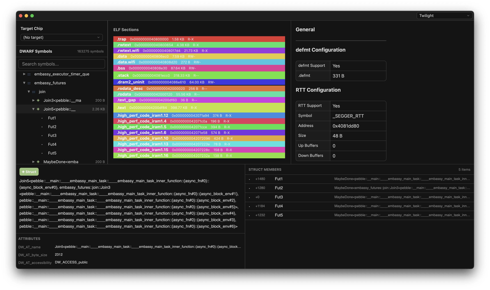

# Mason

A beautiful DWARF debug symbol browser for ELF files built with [GPUI](https://github.com/zed-industries/zed/tree/main/crates/gpui).



## Features

- Browse DWARF debug symbols
- View symbol details (address, size, type, source location)
- Automatic symbol demangling (Rust, C++)
- Make sure the regions match the regions of a [probe-rs](https://github.com/probe-rs/probe-rs) target

## Building

```bash
cargo build --release
```

## Usage

```bash
cargo run --release -- <path-to-elf-file>
```

## License

Licensed under either of

Apache License, Version 2.0 (LICENSE-APACHE or http://www.apache.org/licenses/LICENSE-2.0)
MIT license (LICENSE-MIT or http://opensource.org/licenses/MIT) at your option.
